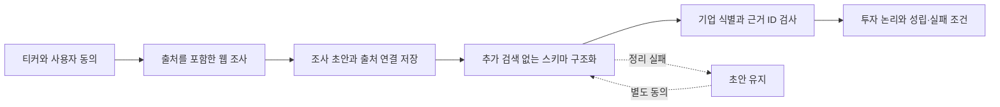

# SignalDesk

**주가는 왜 움직였고, 이 기업의 투자 논리가 성립하려면 무엇이 달라져야 할까?**

미국 주식의 일봉 이상 변동, 출처가 연결된 원인 후보, 기업별 투자 논리와 증권 발행 관련 공시를 한 화면에서 확인하는 **로컬 리서치 MVP**입니다. 업종별 정답을 하드코딩하지 않고 동일한 조사 흐름을 적용합니다.

`Python` · `FastAPI` · `Next.js / React` · `OpenAI Responses API` · `SQLite`

> 주가 예측·목표주가 산정·자동매매 서비스가 아닙니다. AI가 정리한 조건과 출처를 사용자가 검토하는 도구입니다. 공개 서비스가 아닌 1인 로컬 사용을 기준으로 설계했습니다.

## 왜 만들었나

차트에서 급등락을 발견한 뒤 뉴스·공시·IR을 따로 찾아보고, 발표가 이미 완료된 사실인지 앞으로 확인할 조건인지 다시 구분해야 했습니다. 일반적인 뉴스 요약만으로는 “그래서 이 회사에서 다음으로 무엇을 확인해야 하는가?”가 남았습니다.

SignalDesk는 이 과정을 **수치 탐지 → 근거 조사 → 투자 논리를 검증할 조건 정리**로 연결합니다. 데이터를 더 많이 나열하기보다, 사실·해석·미확인을 구분하는 데 집중했습니다.

## 주요 기능

| 기능 | 사용자에게 보여주는 것 | 의도적으로 하지 않는 것 |
|---|---|---|
| 가격·이상 변동 | 수정 일봉, 수익률, 거래량 비율, 같은 기간의 SPY 수익률 차이 | 실시간 시세, 원인 확정, 수익률 예측 |
| 날짜별 원인 조사 | 선택 날짜 전후의 공개자료와 주가 변동 원인 후보 | 뉴스 한 건을 상승·하락의 확정 원인으로 단정 |
| 뉴스 근거·미래 이벤트 | 연결된 공시 근거와 아직 결과가 나오지 않은 이벤트, 유리·불리한 조건 | 전체 뉴스의 실시간 수집, 빈 결과를 “위험 없음”으로 해석 |
| 투자 논리 엔진 | 사업 구조, 핵심 투자 논리, 중요한 조건 최대 3개, 다음 확인 사항과 출처 | 기업별 고정 답변, 매수·매도 추천, 시장 컨센서스 주장 |
| Dilution Watch | SEC 서류·문구에서 등록·발행 조건·완료 관련 신호 구분 | 미공개 증자 예측, 실제 발행 확정, 임의 희석률 계산 |

### 사용 흐름

**티커 조회 → 관심 날짜 선택 → 원인 조사 → 투자 논리 확인 → 필요한 경우 SEC 확인**

가격 조회와 저장본 읽기는 유료 AI를 호출하지 않습니다. AI 조사는 비용 안내와 동의 후 실행합니다. SEC 직접 확인은 별도이며, SEC 제한이 생겨도 AI 분석 실패와 구분해 표시합니다.

## 설계의 핵심

### 1. 수치 계산과 AI 해석을 분리

일봉 이상 변동은 Python 규칙으로 계산합니다. 이벤트 당일을 제외한 직전 20개 수익률을 기준으로, `|수익률| ≥ 5% 및 |z-score| ≥ 3` 또는 `|수익률| ≥ 10%`인 경우를 선별합니다. 필요한 관측 수, 분할일, 긴 날짜 공백 등 추가 조건을 확인합니다.

이 결과는 조사할 날짜를 고르는 장치입니다. z-score는 상승 확률이 아니며, SPY와의 차이는 베타·섹터 조정 초과수익이 아닙니다.

### 2. 웹 조사와 구조화를 두 단계로 분리



자유서술형 조사 초안을 먼저 저장한 뒤, 그 초안과 근거 문단만으로 JSON을 구성합니다. 구조화에 실패해도 성공한 웹 조사 초안을 보존합니다. 유효한 항목을 보존하되 잘리거나 잘못된 JSON 전체를 임의로 복구하지는 않습니다.

근거 ID와 URL 연결을 검사하는 것은 **독립적인 사실 검증이 아닙니다**. 근거 문단 자체도 조사 AI의 요약일 수 있으므로 원문 대조가 필요합니다.

### 3. 비용과 실패를 제품의 일부로 처리

새 투자 논리 분석은 최대 2회 API 시도이며, 첫 요청의 웹 도구 사용은 최대 8회입니다. 정리만 다시 요청하는 경우에는 새 웹 검색 없이 최대 1회입니다. 모든 AI 기능에 공동 20회/일 시도 한도와 단일 프로세스 작업 잠금을 적용합니다. 이 한도는 금액 상한이 아니며 실패한 요청도 비용이 발생할 수 있습니다.

자동 유료 재시도는 없습니다. SEC 접근 거절·제한에는 쿨다운을 적용하고, 이전 저장본과 실패 상태를 구분합니다. 선택적 SEC 재확인은 보이는 탭에서만 5분 간격으로 작동하며, 기본값은 꺼짐입니다.

## 기술 구조

| 영역 | 구현 |
|---|---|
| 화면 | Next.js 정적 export, React, 같은 출처의 FastAPI API 사용 |
| 서버 | Python / FastAPI / Uvicorn, 기본 `127.0.0.1:8017` |
| 시세 | yfinance를 통한 Yahoo Finance 수정 일봉, SPY 비교 |
| AI | HTTPX로 Responses API 호출, 웹 조사 및 스키마 구조화 |
| 저장 | AI 보고서·사용량용 SQLite, 일부 자료·초안·SEC 상태용 로컬 JSON |
| 검증 | Python unittest, Node 내장 테스트, 소스·정적 출력·로컬 HTTP 검사 |

벡터 DB, 임베딩 검색, 모델 파인튜닝, 분산 작업 큐는 사용하지 않습니다. 과거 가치평가·문서 입력 관련 코드는 호환성과 테스트를 위해 일부 남아 있지만 현재 간단 화면의 기능에는 포함하지 않습니다.

## 실행 방법 — Windows

소스 공개본에는 `.venv`, `node_modules`, 빌드 결과, API 키, 개인 캐시가 들어 있지 않습니다. **Python 3.11, Node.js 20.9 이상, npm**을 준비하고 저장소 루트에서 아래 순서로 실행합니다. 의존성은 저장소의 지정 버전을 사용합니다.

### 1. 의존성 설치

```powershell
py -3.11 -m venv .venv
.\.venv\Scripts\python.exe -m pip install -r .\backend\requirements.txt

Push-Location .\frontend
npm.cmd ci
Pop-Location
```

각 명령의 성공을 확인한 뒤 다음 단계로 넘어갑니다. 설치가 실패하면 버전이나 오류를 확인하고, 기존 핀을 임의로 최신 버전으로 바꾸지 않습니다.

### 2. 프론트 테스트·빌드·출력 검사

```powershell
powershell.exe -NoProfile -ExecutionPolicy Bypass -File .\Build-Frontend.ps1
```

### 3. 선택 사항: AI 설정

```powershell
powershell.exe -NoProfile -ExecutionPolicy Bypass -File .\Configure-AI.ps1
```

키는 입력이 숨겨진 프롬프트로 설정하며 프로젝트의 `.env.signaldesk`에 저장됩니다. 이 파일은 평문 로컬 설정이며 공개하면 안 됩니다. AI 키 없이도 가격 조회를 사용할 수 있습니다. SEC 식별용 이메일은 SEC 기능을 쓸 때 화면에서 별도로 설정합니다.

### 4. 실행

```powershell
powershell.exe -NoProfile -ExecutionPolicy Bypass -File .\Start-SignalDesk.ps1
```

브라우저에서 `http://127.0.0.1:8017`을 확인합니다. 종료는 서버 터미널에서 `Ctrl+C`입니다. GitHub에 소스를 올리는 것과 웹 서비스를 배포하는 것은 다릅니다. 이 저장소는 인증·다중 사용자·인터넷 공개 운영을 준비한 배포본이 아닙니다.

## 테스트와 검증 상태

```powershell
$env:PYTHONPATH = Join-Path $PWD "backend"
.\.venv\Scripts\python.exe -m unittest discover -s .\backend\tests -p test_signaldesk.py
.\.venv\Scripts\python.exe -m unittest discover -s .\backend\tests -p test_stock_watch110.py
.\.venv\Scripts\python.exe -m unittest discover -s .\backend\tests -p test_thesis120.py

Push-Location .\frontend
npm.cmd test
Pop-Location
```

v1.2.0 작성 환경의 기록은 백엔드 선별 그룹 170개, 프론트 헬퍼 292개, 출력 검사 28개, 설치·복구 5개 통과입니다. **전체 과거 백엔드 테스트 통과, 실제 기업 조사 품질, 새 Windows 설치 성공을 의미하지 않습니다.** 재현 명령, 실패·미검증 범위는 [검증 기록](docs/VERIFICATION.md)에 구분했습니다. 수익률·정확도·시간 절감 성과는 측정하지 않았습니다.

## 데모와 코드 탐색

실제 애플리케이션 출력만 캡처해 공개합니다. 권장 화면과 개인정보 점검 항목은 [스크린샷 가이드](docs/SCREENSHOTS.md)에 있습니다.

<!-- SCREENSHOTS_START: 실제 캡처를 확인한 후에만 이 아래에 이미지를 추가합니다. -->
<!-- SCREENSHOTS_END -->

- [아키텍처와 핵심 코드](docs/ARCHITECTURE.md)
- [제품 개요와 설계 원칙](docs/PRODUCT_OVERVIEW.md)
- [투자 논리 파이프라인 상세](docs/THESIS_ENGINE.md)
- [검증 기록과 알려진 한계](docs/VERIFICATION.md)
- [보안·데이터 공개 주의](SECURITY.md)
- [제3자 구성요소](docs/THIRD_PARTY_NOTICES.md)

## 한계와 개발 범위

공개자료 누락, 오래된 공시, 티커 식별 오류, 검색·모델·네트워크 실패로 중요한 변수를 놓칠 수 있습니다. 투자 논리는 AI 해석이며 시장의 합의나 독립 팩트체크가 아닙니다. 미래 조건이 충족돼도 주가가 같은 방향으로 움직인다고 보장할 수 없습니다.

생성형 AI를 개발 보조에 활용한 개인 프로젝트입니다. 문제 정의와 기능 범위 조정, 사용자 흐름, 로컬 실행·오류 피드백을 중심으로 발전시켰습니다. 공개 저장소에는 사용자 API 키, 계정 설정, 개인 분석 이력과 주문 정보가 포함되지 않습니다.
