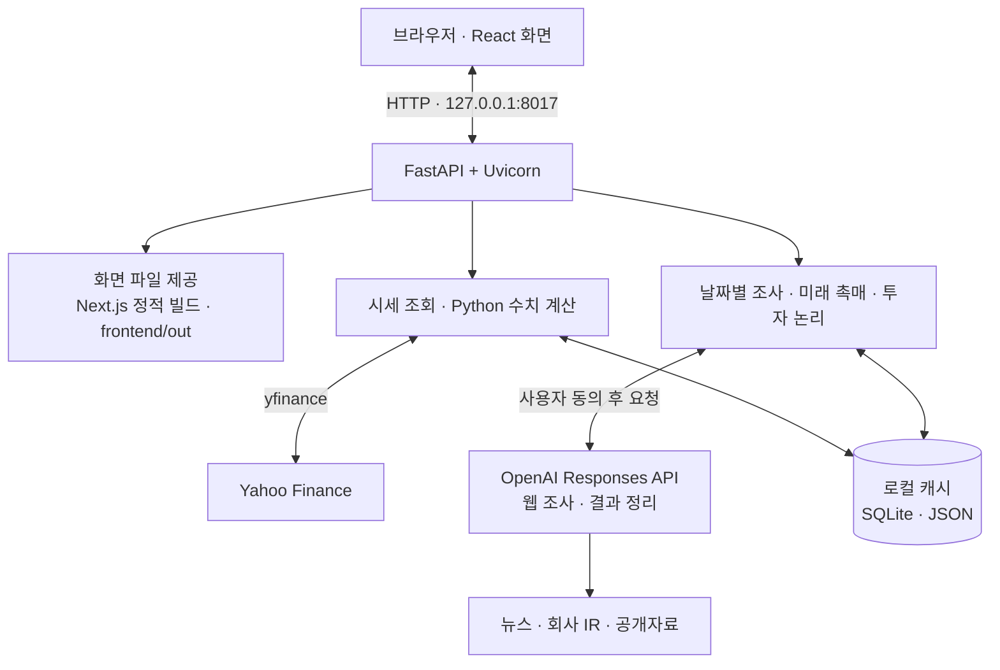

# SignalDesk

**주가는 왜 움직였고, 앞으로 무엇을 확인해야 할까?**

미국 주식의 가격 변동, 관련 사건, 향후 촉매와 투자 논리를 한곳에서 확인하는 **개인용 로컬 리서치 앱**입니다. 숫자는 Python으로 계산하고, 공개자료 조사와 해석은 AI가 맡습니다.

`v1.3.0 · SD-130-FORWARD-CATALYSTS`  
`Python · FastAPI · Next.js / React · yfinance · OpenAI Responses API`

> 주가 예측, 목표주가 산정, 자동매매 도구가 아닙니다. 조사할 사건과 앞으로 검증할 조건을 정리하며, 최종 판단은 사용자가 출처를 확인한 뒤 내립니다.

## 주요 기능과 동작 방식

### 1. 가격 차트와 시장 비교

**보여주는 것:** 종목의 수정 일봉 가격과 거래량, 선택 기간 수익률, SPY 대비 움직임입니다. 1개월·3개월·6개월·1년·3년 기간을 선택하고, 차트에서 특정 거래일을 확인할 수 있습니다.

**처리 방식:** `yfinance`로 Yahoo Finance의 수정 일봉을 가져오고, Python이 수익률과 비교 지표를 계산한 뒤 화면에 전달합니다. 실시간 체결 데이터가 아니라 분할·배당을 반영한 일봉을 사용합니다.

```text
일간 수익률 = 오늘 수정종가 / 직전 거래일 수정종가 - 1
SPY 대비 일간 차이 = 종목 일간 수익률 - 같은 거래일 SPY 수익률
```

SPY 대비 차이는 단순 수익률 차이이며, 베타나 섹터 위험을 조정한 초과수익은 아닙니다. 시세 조회에는 AI를 사용하지 않으며, 데이터가 오래되었거나 비교 자료를 확보하지 못하면 경고를 표시합니다.

### 2. 이상 변동 탐지와 날짜별 원인 조사

**보여주는 것:** 평소보다 크게 움직인 거래일, 해당 날짜의 수익률·거래량 비율, 그리고 관련 뉴스와 공개자료를 바탕으로 정리한 원인 후보입니다.

**처리 방식은 두 단계입니다.** 먼저 Python이 이벤트 당일을 제외한 직전 20개 수익률을 기준으로 이상 변동을 선별합니다. 기본 가격 기준은 `절대 수익률 ≥ 5%이면서 |z-score| ≥ 3` 또는 `절대 수익률 ≥ 10%`이며, 관측 수와 분할일·날짜 공백 등 추가 조건도 확인합니다. 여기서 z-score는 평소 움직임에 비해 얼마나 이례적인지를 나타내는 지표이지 상승 확률이 아닙니다.

그다음 사용자가 날짜를 선택하고 유료 조사에 동의하면, 서버가 보관한 해당 시세 스냅샷의 티커·날짜·가격 지표로 AI 웹 조사를 요청합니다. AI는 그 시점 전후의 사건을 찾아 원인 후보와 출처를 정리합니다. 이상 변동이 아닌 날짜도 직접 선택해 조사할 수 있습니다.

```text
수정 일봉 → Python 수치 탐지 → 사용자 날짜 선택
                                   ↓ 유료 조사 동의
                         AI 웹 조사 → 원인 후보·출처
```

**가격이 크게 움직였다는 사실과 그 이유에 대한 해석은 별개입니다.** 같은 날 뉴스가 있었다고 해서 그 뉴스가 주가 변동의 확정 원인이라고 단정하지 않습니다.

### 3. 미래 촉매: 앞으로 확인할 일정

**보여주는 것:** 실적 발표, 제품·사업 이정표, 규제 관련 일정 등 향후 확인할 이벤트입니다. 각 항목에는 일정, 중요한 이유, 긍정·부정 시나리오, 발표 후 확인할 내용과 출처를 함께 표시합니다.

**처리 방식:** 사용자가 조사를 실행하면 기존 미래 일정 조사 엔진이 **미국 동부 기준 조사일로부터 향후 180일**의 공개자료를 찾습니다. 선택한 과거 주가 날짜를 기준으로 미래를 추정하는 기능은 아닙니다. AI 보고서와 확보된 저장 원문 일정 후보를 화면에서 함께 정리하며, 종목·출처 연결과 날짜 상태를 검사합니다.

| 일정 구분 | 의미 |
|---|---|
| 발표일정 | 회사·기관이 특정 날짜를 발표한 일정 |
| 발표기간 | 분기·반기 등 일정 범위가 발표된 항목 |
| 예상 일정 | 추정된 시점으로, 확정 일정과 구분 |
| 날짜 미확인 | 시점을 확인하지 못한 항목 |

30일·90일·180일 및 날짜 미확인 필터를 제공하고, 지난 일정은 숨깁니다. 출처 간 날짜 충돌이나 미확인 정보를 임의로 확정 일정으로 바꾸지 않습니다.

기업별 출처에 연결된 조건이 충분하면 해당 기업의 시나리오를 우선 표시합니다. 그렇지 않으면 일반적인 이벤트 유형별 판단 기준임을 구분합니다. **촉매가 있다는 사실은 주가 상승을 보장하지 않으며, 결과가 비어 있다고 이벤트가 없다는 뜻도 아닙니다.**

### 4. 투자 논리: 무엇이 달라져야 하는가

**보여주는 것:** 기업의 사업 구조, 핵심 투자 가설, 중요한 조건 최대 3개, 자금 관련 위험과 아직 확인하지 못한 사항입니다. 단순 뉴스 요약을 넘어 “이 기업의 투자 논리가 성립하거나 약해지는 조건”을 정리합니다.

**처리 방식:** 웹 조사와 결과 구조화를 분리한 두 단계로 동작합니다.

```text
1차 AI 요청: 기업 식별 → 공개자료 웹 조사 → 출처가 포함된 조사 초안
서버 처리:  조사 초안 저장 → 출처 URL과 근거 문단에 ID 부여
2차 AI 요청: 추가 웹 검색 없이 초안과 근거를 정해진 JSON 형식으로 정리
서버 검사:  종목·근거 ID·항목 형식 확인 → 유효한 투자 논리 표시
```

다른 기업의 정보, 근거가 연결되지 않은 항목, 지나치게 일반적인 조건 등을 걸러내며, 일부 항목에 문제가 있어도 유효한 항목은 보존합니다. 정리 단계가 실패하면 조사 초안을 남기고, 재사용 조건을 만족하는 초안은 별도 동의를 받아 정리만 다시 요청할 수 있습니다.

출처와 근거 ID를 검사하는 것은 **형식과 연결을 확인하는 절차**입니다. AI가 요약한 내용이 실제 원문과 일치하는지 독립적으로 사실 검증을 완료했다는 의미는 아닙니다.

## 아키텍처



Next.js 화면을 정적 파일로 빌드한 뒤 **FastAPI가 화면과 API를 같은 로컬 주소에서 제공**합니다. 기본 실행에서는 별도의 Next.js 개발 서버를 띄우지 않습니다. `Start-SignalDesk.ps1`이 Python 실행기를 호출하고, 실행기가 화면 빌드 상태를 확인한 뒤 로컬 서버를 시작합니다.

브라우저는 서버가 만든 시세 스냅샷 ID를 전달해 조사 대상을 지정합니다. 서버는 요청 종목·날짜와 결과가 맞는지 확인하고, AI 보고서·사용량과 조사 초안 등을 로컬 저장소에 보관합니다. 화면에서 저장본을 다시 읽는 것만으로 새 유료 조사를 시작하지 않습니다.

### 주요 코드

| 영역 | 주요 파일과 역할 |
|---|---|
| 화면 | `frontend/app/page.jsx`: 종목 조회, 날짜 선택, 기능 연결 |
| 화면 구성요소 | `frontend/components/`: 차트, 원인 조사, 미래 촉매, 투자 논리 패널 |
| API | `backend/app/main.py`: 시세·AI 요청 처리와 정적 화면 제공 |
| 시세·계산 | `backend/app/provider.py`, `engine.py`: 시세 수집, 수익률과 이상 변동 계산 |
| AI 조사 | `backend/app/research.py`: 날짜별·미래 일정 조사와 저장 결과 처리 |
| 미래 촉매 | `backend/app/catalyst_api.py`: 저장본 조회와 명시적 조사 요청 |
| 투자 논리 | `backend/app/thesis_engine.py`, `watch_api.py`, `watch_store.py`: 두 단계 조사·구조화, API, 로컬 초안 저장 |
| 실행 | `Start-SignalDesk.ps1`, `scripts/run.py`: 로컬 서버 실행과 화면 빌드 확인 |

### 대표 API

| 요청 | 역할 |
|---|---|
| `GET /api/v1/market/{ticker}` | 시세와 수치 기반 분석 조회 · AI 호출 없음 |
| `POST /api/v1/ai/analyze` | 선택한 날짜의 원인 후보 조사 |
| `GET /api/v1/catalysts/state` | 저장된 미래 촉매 보고서 조회 |
| `POST /api/v1/catalysts/analyze` | 새 미래 촉매 조사 |
| `GET /api/v1/watch/state` | 저장된 투자 논리와 초안 조회 |
| `POST /api/v1/watch/drivers` | 투자 논리 조사 또는 초안 재정리 |

## 비용·데이터·오류 처리

가격 조회와 저장본 읽기는 유료 AI를 호출하지 않습니다. 새 AI 조사는 사용자가 동의하고 실행해야 하며, 티커·날짜·가격 지표 등 조사에 필요한 정보가 외부 API로 전송됩니다. **서버가 PC에서 실행된다고 해서 모든 처리가 오프라인인 것은 아닙니다.**

날짜별 원인 조사와 미래 촉매 조사는 각각 최대 1회, 새 투자 논리 분석은 최대 2회 API 요청을 시도합니다. 웹 검색 비용이 추가될 수 있으며, 공동 일일 요청 시도 한도는 금액 상한이 아닙니다. 실패나 브라우저 대기 시간 초과가 곧 비용 미발생을 의미하지 않으며, 자동 유료 재시도는 하지 않습니다.

유료 요청에는 로컬 요청 토큰과 동일 출처 검사를 적용하고, 진행 중 작업과 중복 요청을 제한합니다. 이는 개인용 로컬 실행을 위한 보호 장치이며 인터넷 공개 서비스용 로그인·사용자 권한 체계를 대신하지 않습니다. API 키와 개인 캐시·설정 파일은 공개 저장소에 올리지 않아야 합니다.

## 실행 방법 — Windows

**기존 SignalDesk 설치와 v1.3.0 업데이트가 완료된 프로젝트 기준**입니다. README 교체만으로 앱 설치, 버전 업데이트 또는 화면 빌드가 수행되지는 않습니다.

프로젝트 폴더에서 PowerShell로 실행합니다.

```powershell
Set-Location "C:\Projects\signaldesk"
powershell.exe -NoProfile -ExecutionPolicy Bypass -File .\Start-SignalDesk.ps1
```

브라우저 접속 주소는 `http://127.0.0.1:8017`입니다. 종료하려면 서버 터미널에서 `Ctrl+C`를 누릅니다. AI 키가 설정되지 않았다면 기존 설치본의 `Configure-AI.ps1`로 설정합니다. 키는 채팅이나 README에 붙여 넣지 않습니다.

## 범위와 한계

v1.3.0부터 **SEC 직접 조회 기반 Dilution Watch, 관련 이메일 입력과 자동 재확인 기능은 제공하지 않습니다.** 공개 웹 조사에서 SEC·회사 공시가 출처로 인용될 수는 있으나, 이를 실시간 희석 감시 기능으로 해석해서는 안 됩니다.

시세 지연, 검색 누락, 잘못된 기업 식별, 일정 변경과 AI 해석 오류가 발생할 수 있습니다. 출처 링크가 있다는 사실만으로 최신성·정확성·완전성이 보장되지는 않습니다. 중요한 일정, 수치와 계약 조건은 원문에서 다시 확인해야 합니다.
