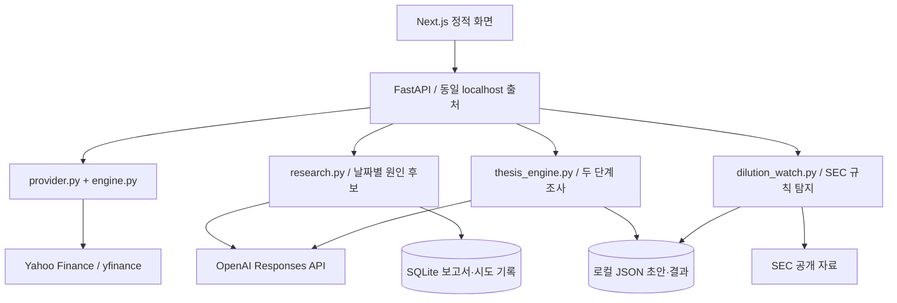

# 아키텍처와 핵심 코드

## 한 문장

**수치 계산은 코드가, 공개자료 조사는 모델이, 최종 투자 판단은 사용자가 맡는다.**

## 화면에서 실제 호출하는 경로

| 동작 | 대표 API | 핵심 구현 |
|---|---|---|
| 시세 조회 | `GET /api/v1/market/{ticker}` | `provider.py`, `engine.py`, `price_context.py` |
| 날짜별 원인 조사 | `POST /api/v1/ai/analyze` | `research.py` |
| 이벤트 조사 | `POST /api/v1/ai/outlook/analyze` | `outlook.py`, `outlook_quality.py` |
| 저장 투자 논리·SEC 상태 | `GET /api/v1/watch/state` | `watch_api.py` |
| 새 투자 논리·초안 정리 재개 | `POST /api/v1/watch/drivers` | `thesis_engine.py` |
| SEC 발행 관련 신호 확인 | `POST /api/v1/watch/dilution` | `dilution_watch.py` |

화면은 `frontend/app/page.jsx`, 원인 조사는 `AIResearch.jsx`, 뉴스·일정은 `DeskOverview.jsx` / `NewsEventBoard.jsx`, 투자 논리·SEC는 `StockWatch.jsx`가 담당합니다.

## 투자 논리 파이프라인

1. 서버 시세 조회 시 만들어진 스냅샷을 참조하고, 명시적 비용 동의를 검사합니다.
2. 동일한 조사 프롬프트가 해당 발행사를 식별한 뒤 고객·제품·실행·수익성·규제·자금의 여섯 축 중 중요한 1~3개를 찾습니다. 여섯 칸을 무조건 채우지 않습니다.
3. 모델 최종 출력의 인용 메타데이터에서 출처 `S…`와 연결된 조사 문단 `E…`를 구성합니다. 이 문단은 원문 그 자체가 아니라 AI 조사 결과입니다.
4. 성공한 초안을 저장한 뒤, 그 초안만 입력으로 사용하여 추가 검색 없는 스키마 구조화를 요청합니다.
5. 기업 식별, 근거 참조, 항목 길이·중복·상태 등을 검사합니다. 항목 단위로 유효한 결과를 보존하되 식별 실패나 미완성 JSON을 완성 보고서로 승격하지 않습니다.
6. 사업 구조, 조건부 핵심 논리, 성립·실패 조건과 다음 확인 사항을 출처와 함께 표시합니다.

## 비용·캐시·동시성

가격 조회는 유료 AI와 분리합니다. 날짜별 원인 저장본은 24시간, 투자 논리·조사 초안은 회사·조사일·6시간 조건을 사용합니다. 저장본이 존재한다고 최신 원문을 다시 확인했다는 뜻은 아닙니다.

`ResearchService`의 단일 프로세스 잠금과 SQLite 시도 기록을 공유합니다. 새 투자 논리는 최대 두 번의 API 시도를 각각 한도에 반영합니다. 앱을 여러 프로세스·서버로 확장할 때 그대로 재사용할 수 있는 분산 잠금이나 작업 큐는 아닙니다.

화면의 AbortController 시간 초과는 브라우저 대기를 중단하는 장치입니다. 이미 시작된 외부 AI 호출과 과금을 반드시 취소하는 것은 아닙니다. 따라서 실패 후 자동 유료 재요청을 하지 않습니다.

## SEC 신호의 의미

최근 자료 중 정해진 기간·문서 수 범위만 확인하는 제한된 스캐너입니다. 서류 종류와 본문 문구를 함께 다루지만 “등록”, “발행 조건”, “완료 언급”은 모두 추가 확인이 필요한 신호입니다. 기존 주식 재판매와 신규 발행을 구분하려고 하며, 신호 수를 실제 신주 수로 바꾸지 않습니다.

403/429 등 제한에는 쿨다운과 가능한 Retry-After를 적용합니다. 보이는 탭에서만 동작하는 선택적 재확인이지 서버 백그라운드·푸시 서비스가 아닙니다.

## 오류 처리에서 배운 점

- **응답 형식 실패:** 한 번의 호출에 검색과 엄격한 JSON을 모두 맡기지 않고 조사 초안과 구조화를 분리했습니다. 추가 호출 비용이라는 대가가 있습니다.
- **빌드와 실제 화면 불일치:** 소스·정적 산출물·로컬 서버의 빌드 식별자와 파일 해시를 확인합니다. 번역된 버튼 문구 자체보다는 실제 요소의 고정 식별자로 기능 존재를 검사합니다.
- **Windows 프로세스 검사:** 가상환경 실행기 PID와 서버 PID가 항상 같다는 가정을 제거하고, 검사기 내 서버와 실제 응답의 식별값을 확인하는 방식으로 정리했습니다. 로그로 증명할 수 없는 정확한 실패 원인은 단정하지 않습니다.

`Build-Frontend.ps1`, `scripts/verify_frontend.py`, `scripts/run.py`, `scripts/smoke_local.py`가 관련 코드입니다. 업데이트 ZIP의 트랜잭션 설치기와 공개 소스 저장소는 같은 배포물이 아니며, 이 저장소에 과거 ZIP을 다시 올리지 않습니다.

## 의도적으로 범위에서 뺀 것

목표주가·DCF·복잡한 재무 입력 UI, 자동 주문, 수익률 백테스트, 벡터 DB, 다중 에이전트 합의, 다중 사용자 인증, 분산 큐와 클라우드 상시 모니터링은 현재 제품 범위가 아닙니다.

일부 구버전 valuation·filing 모듈과 테스트는 호환성 때문에 남아 있습니다. 코드가 남아 있다는 사실을 숨기지 않되 현재 화면에서 제공되는 기능과 구분합니다. 전체 레거시 제거는 이번 공개를 위한 필수 리팩터링으로 삼지 않았습니다.

## 읽기 순서

`frontend/app/page.jsx` → `backend/app/main.py` → `backend/app/engine.py` → `backend/app/watch_api.py` → `backend/app/thesis_engine.py` → `backend/tests/test_thesis120.py`.

의미 검증 한계는 [검증 기록](VERIFICATION.md), 모델 입력·출력 세부사항은 [Thesis Engine](THESIS_ENGINE.md)에 있습니다.
